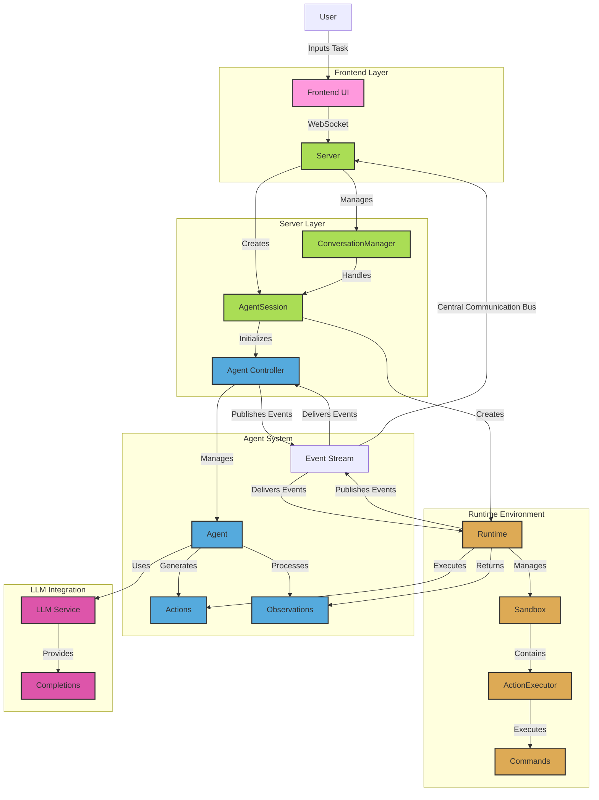

```mermaid
graph TD
    User[User] -->|Inputs Task| Frontend
    
    subgraph "Frontend Layer"
        Frontend[Frontend UI] -->|WebSocket| Server
    end
    
    subgraph "Server Layer"
        Server[Server] -->|Creates| AgentSession
        AgentSession -->|Initializes| AgentController
        Server -->|Manages| ConversationManager
        ConversationManager -->|Handles| AgentSession
    end
    
    subgraph "Agent System"
        AgentController[Agent Controller] -->|Manages| Agent
        Agent -->|Generates| Actions
        Agent -->|Processes| Observations
        AgentController -->|Publishes Events| EventStream
        EventStream -->|Delivers Events| AgentController
    end
    
    subgraph "Runtime Environment"
        Runtime[Runtime] -->|Executes| Actions
        Runtime -->|Returns| Observations
        Runtime -->|Manages| Sandbox
        Sandbox -->|Contains| ActionExecutor
        ActionExecutor -->|Executes| Commands
        Runtime -->|Publishes Events| EventStream
        EventStream -->|Delivers Events| Runtime
    end
    
    subgraph "LLM Integration"
        Agent -->|Uses| LLM
        LLM[LLM Service] -->|Provides| Completions
    end
    
    %% Connections between components
    AgentSession -->|Creates| Runtime
    EventStream[Event Stream] -->|Central Communication Bus| Server
    
    %% Data flow
    classDef frontend fill:#f9d,stroke:#333,stroke-width:2px
    classDef server fill:#ad5,stroke:#333,stroke-width:2px
    classDef agent fill:#5ad,stroke:#333,stroke-width:2px
    classDef runtime fill:#da5,stroke:#333,stroke-width:2px
    classDef llm fill:#d5a,stroke:#333,stroke-width:2px
    
    class Frontend frontend
    class Server,AgentSession,ConversationManager server
    class AgentController,Agent,Actions,Observations agent
    class Runtime,Sandbox,ActionExecutor,Commands runtime
    class LLM,Completions llm
```
